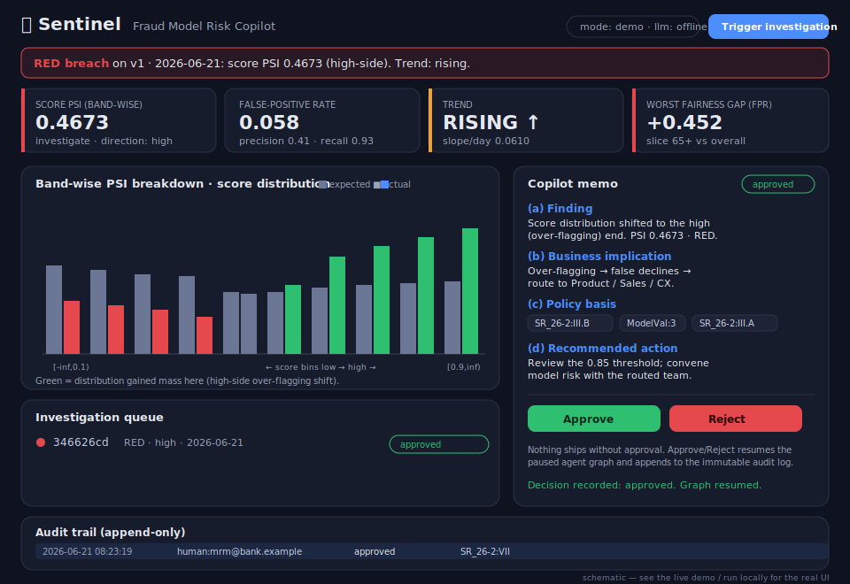

<div align="center">

# 🛡️ Sentinel

### A Fraud Model Risk Copilot for the post-SR&nbsp;26-2 world

*Watch a deployed fraud model drift in real time. Translate the drift into a business decision. Cite the governing policy. Then stop — and wait for a human to approve.*

[](https://github.com/reetu58/Sentinel/actions/workflows/ci.yml)
[](LICENSE)
[](https://www.python.org/)
[](docs/runbooks/data.md)
[](https://sentinel-g6gw.onrender.com/)
[-46E3B7.svg)](docs/runbooks/deploy.md)
[](#-design-principles)

**[▶ Live demo](https://sentinel-g6gw.onrender.com/) · [3-minute walkthrough](docs/DEMO_SCRIPT.md) · [Scoping brief](docs/research/Sentinel_Scoping_Brief.md)**

<sub>Hosted free on Render — if it's been idle it sleeps, so the first load may take ~30–60s to wake. See [docs/runbooks/deploy.md](docs/runbooks/deploy.md) to deploy your own.</sub>

</div>

---

> **This README is an annotated case file.** It reads top-to-bottom as the story
> of one problem: a fraud model that quietly degrades, what that costs, the
> regulation that governs it, and a working prototype of the controls the newest
> guidance demands. Code and runbooks are linked at each step.

## The problem, in one paragraph

A production fraud model is never static — the fraud it hunts adapts, and the
customer population shifts under it. When the model drifts, it fails in **two
opposite and equally expensive directions**, and a single headline "drift"
number hides which one you're bleeding from:

| Drift direction | What's happening | The cost | Route to |
| --- | --- | --- | --- |
| **High-side** shift | model over-flagging | **false declines** — lost revenue, customer friction, investigation load | Product / Sales / CX |
| **Low-side** shift | under-detection | **fraud losses + regulatory exposure** | Risk / Finance / Legal |
| **Mid / threshold** shift | unstable at the decision boundary | **decision instability** | Ops / Finance planning |

Catching this early, every day, and turning it into a *routed business decision*
— not just a dashboard number — is slow, manual model-risk work today. Sentinel
automates the analysis and the policy lookup, and keeps a human firmly in charge
of the decision.

## The thesis (why *now*)

In **April 2026, SR 26-2 replaced SR 11-7** and deliberately placed generative
and agentic AI **outside** US model-risk guidance — calling them "novel and
rapidly evolving" — while keeping traditional ML fraud and credit models **fully
in scope**. That creates a fault line:

- The **classical model** Sentinel monitors is squarely *in* scope — it needs
  the rigorous, daily, band-wise monitoring model-risk teams have always owed.
- The **agentic system** doing the monitoring is in the *carve-out* — banks must
  govern it under their own practices, with no regulatory template.

**Sentinel is built directly on that fault line.** It monitors an in-scope
traditional fraud model **and** demonstrates the exact controls the carve-out now
demands of agentic systems: **defined agent actions, mandatory human approval,
and an immutable, policy-cited audit trail.**

> Built solo, end-to-end, on **public data only**, and deployed live.

---

## Industry context

Sentinel is a prototype of a frontier that regulators and banks are actively
moving toward.

- **SR 26-2 (April 2026)** superseded **SR 11-7 (2011)**, the foundational US
  model-risk guidance. It keeps traditional ML models (fraud, credit) in scope
  and pushes generative/agentic AI *out* of formal model-risk scope — banks own
  that governance themselves. Sentinel sits on both sides at once.
- **EU AI Act** — credit/fraud decisioning that affects consumers is **high-risk**,
  with obligations for risk management, data governance & bias monitoring, human
  oversight, and accuracy/robustness monitoring. Full high-risk enforcement lands
  **August 2026**. Sentinel's fairness audit and human gate map directly to these.
- **The agentic-governance frontier** — banks are piloting **agent-proposes /
  human-approves** patterns exactly like this one, and bodies such as the FSB have
  flagged the systemic angle of **AI monitoring AI**. The open question everyone
  is circling is: *what controls make an agent that touches a production model
  safe?* Sentinel's answer is a worked example — scoped actions, a hard human
  gate, and an append-only audit trail.

The point isn't that Sentinel *is* production model governance. It's that every
design choice is a concrete, inspectable take on a control the industry is still
writing the rules for.

---

## Architecture — and how each piece maps to a real governance workflow

A real build, not a simulation: Kafka, a daily orchestrated job, Postgres,
agents, and a live-deployed app.

```
   PaySim / IEEE-CIS CSV  (public data)
            │
            ▼
   Kafka  (Redpanda locally)  ──►  transactions topic
            │
            ▼
   XGBoost scoring  ──►  scored-txns topic  (score + ground-truth label)
            │
            ▼
   Daily Airflow DAG
     • PSI on model score — read BAND-WISE, not just the aggregate
     • CSI per feature vs a frozen baseline
     • precision / recall / FPR + fairness gaps (Bank Account Fraud Suite)
            │
            ▼
   Postgres  (metrics + immutable audit log)
            │
            ▼
   LangGraph agents
     Monitor ──► Investigator (RAG, cited) ──► Drafter ──► 🧑 Human gate
            │
            ▼
   FastAPI backend  ◄──►  React dashboard        (one container service)
            │
            ▼
   Docker ──► Render / Cloud Run  (one public URL)
```

| Pipeline stage | Real model-governance activity it stands in for |
| --- | --- |
| Kafka spine + XGBoost scoring | The **deployed model in production**, scoring a live transaction stream. |
| Frozen baseline + daily PSI/CSI | **Ongoing monitoring** vs. a versioned reference — the core SR 26-2 / SR 11-7 duty. |
| Band-wise PSI read | The nuance a good validator insists on: *where* did the score move, not just *how much* — a shift at the decision boundary is the dangerous one. |
| FPR + fairness slices (BAF) | **Outcome analysis** and **disparate-impact / bias monitoring** (EU AI Act high-risk). |
| Trend detector | **Early warning** — escalate a sustained rise *before* the hard threshold breach. |
| Monitor → Investigator → Drafter | The analyst workflow: triage materiality → diagnose direction & pull policy → write the memo. |
| RAG with `doc:section` citations | **Traceability** — every claim is grounded in a specific governance passage. |
| Human gate | **Mandatory human approval** — the agent proposes; a person disposes. |
| Append-only audit log | The **immutable activity record** the carve-out demands. |

Full stack: Python · Kafka/Redpanda · Airflow · Postgres · XGBoost · LangGraph ·
Haystack (BM25 RAG) · Anthropic + OpenAI via a thin router · FastAPI · React ·
Docker · Render / Cloud Run.

---

## What it looks like



<sub>Schematic of the dashboard using real demo values. For real captures, run
locally or open the live demo — see [docs/screenshots/](docs/screenshots/).</sub>

### A sample cited memo (real output, verbatim)

When a RED breach fires, the Drafter produces this — plain English, for a
non-technical Risk/Legal reader, every policy claim carrying a `doc:section`
citation from the RAG layer:

```
# Model Risk Alert — score PSI (RED)

## (a) Finding
The model's score distribution has shifted toward the high (over-flagging) end
of the score range. PSI = 0.4673 (investigate / RED), read band-wise: the
largest mass gain is in bin [0.9, inf) (+11.4 pts).

## (b) Business implication
Mechanism: the model is over-flagging. Cost type: false declines (lost revenue,
friction, investigation load). Rough size: on ~48,213 scored transactions/day
at FPR 0.058, a high-side shift increases false declines — size with Finance as
incremental declines × (avg basket value + handling cost). Route to: Product /
Sales / CX.

## (c) Policy basis
Grounded in: [SR_26-2:III.B] Population stability and thresholds; [ModelVal:3]
Monitoring thresholds; [SR_26-2:III.A] Monitoring expectations.

## (d) Recommended action
Review the 0.85 decision threshold against the shifted distribution and convene
model risk management with Product / Sales / CX. This is a recommendation
pending human approval — Sentinel takes no action itself.
```

---

## Run it

### Fastest: the whole app in demo mode (no DB, no API key)

```bash
pip install -r pipeline/requirements.txt -r backend/requirements.txt
SENTINEL_BACKEND_MODE=demo python -m uvicorn backend.app:app --port 8000   # backend
cd frontend && npm install && npm run dev                                  # dashboard → :5173
```

Trigger a RED breach → watch the agent draft a cited memo → approve → see the
audit log update. Walkthrough: [docs/DEMO_SCRIPT.md](docs/DEMO_SCRIPT.md).

### Deploy your own (one container service)

The [live demo](https://sentinel-g6gw.onrender.com/) runs free on **Render** via
the checked-in `render.yaml` — Dashboard → **New +** → **Blueprint** → pick the
repo → **Apply**. A multi-stage `Dockerfile` builds the React app and the FastAPI
backend serves it — one image, one URL, **no secrets baked in** (keys/DSNs come
from the host's env / secret store). The same image runs on Cloud Run, Hugging
Face Spaces, or Fly.io; Postgres, Kafka, and Airflow run *outside* the web host
and the demo needs none of them. Full instructions (Render, Cloud Run, HF Spaces,
plus real-LLM / Postgres options): [docs/runbooks/deploy.md](docs/runbooks/deploy.md).

### Run the real pipeline (Phases 1–3)

The streaming spine, daily metrics, and agent graph each have a runbook:
[data](docs/runbooks/data.md) · [drift & fairness](docs/runbooks/drift.md) ·
[agents & RAG](docs/runbooks/agents.md) · [dashboard](docs/runbooks/dashboard.md).
Tests: `python -m pytest -q` (49 passing, offline).

---

## 🚦 Build status

| Phase | Scope | Status |
| --- | --- | --- |
| **1 — Streaming spine** | Redpanda + Postgres · shared feature module · XGBoost baseline (PR-AUC, imbalance-aware) · producer → `transactions` · consumer → `scored-txns` with label | ✅ |
| **2 — Daily drift, trend & fairness** | Frozen baseline · band-wise PSI + per-feature CSI + precision/recall/FPR · sustained-rise trend detector · BAF fairness audit · Postgres schema + sink · daily CLI + Airflow DAG | ✅ |
| **3 — Agents + RAG** | Haystack BM25 RAG (`doc:section` citations) · LangGraph Monitor → Investigator → Drafter → human gate · thin Anthropic/OpenAI/offline router · append-only audit log | ✅ |
| **4 — Backend + dashboard** | FastAPI (health · queue · trigger · approve/reject · audit) with a SQLite checkpointer so the paused graph resumes across requests · React dashboard, all state server-side | ✅ |
| **5 — Ship it** | One-container Docker build · deployed live on Render (Cloud Run-ready) · annotated case-file README · demo script · pre-public safety pass | ✅ |

---

## 🧭 Design principles

Enforced, not aspirational — see [`CLAUDE.md`](CLAUDE.md) for the full contract.

- **One feature module, train and serve.** `pipeline/features.py` is the single
  source of truth. Train/serve skew is *exactly* the failure Sentinel exists to
  catch — so the model that catches it must never commit it. A parity test
  asserts batch and single-record featurization agree byte-for-byte.
- **PSI read band-wise.** A middling aggregate can hide a dangerous shift at the
  decision boundary. Sentinel reads per-bin direction, not the headline number.
- **Deterministic control logic; LLM only where language matters.** Materiality
  and drift *direction* are computed, not asked of a stochastic model. The LLM
  drafts prose — behind a router that swaps Anthropic / OpenAI / offline with one
  config change.
- **Every agent output is a business implication** — cost type, rough size, and
  the stakeholder to route to — never a bare statistic.
- **Every decision cites its policy source** (`doc:section`) and writes to an
  **immutable, append-only audit log**, model version attached.
- **Nothing side-effecting happens without human approval.** The gate is a
  structural pause in the graph, not a checkbox an agent can flip.

---

## 🔒 Data policy

**Public datasets only.** Sentinel uses **PaySim** (the streaming spine), the
**Bank Account Fraud Suite** (NeurIPS 2022 — protected attributes for the
fairness audit), and optionally **IEEE-CIS**. **Real bank data is confidential
and is never used in this project** — and using public data *because* real data
is confidential is itself a governance-aware signal. `data/` and `models/` are
gitignored; raw data and trained binaries are never committed and must be
re-derived from the documented public sources
([docs/runbooks/data.md](docs/runbooks/data.md)).

---

## ⚠️ Honest scope and limits

Sentinel is a **prototype, not production**.

- On public/synthetic data, results are **illustrative, not deployable** — e.g.
  the synthetic PaySim sample is deliberately clean and shows an unrealistically
  high PR-AUC; real PaySim lands lower.
- The streaming/orchestration layer is a deliberate **thin-but-real** learning
  build — real Kafka, a real daily job, a real deployment, but minimal.
- LLM drafts are **RAG-grounded with citations** to limit fabrication; the
  offline drafter is deterministic.
- Sentinel **assists** a human model-risk manager — it **never self-heals or
  acts autonomously**. Every consequential step is gated and audited.

---

## License

MIT — see [`LICENSE`](LICENSE). Canonical spec: [`CLAUDE.md`](CLAUDE.md).
Positioning brief: [`docs/research/Sentinel_Scoping_Brief.md`](docs/research/Sentinel_Scoping_Brief.md).
